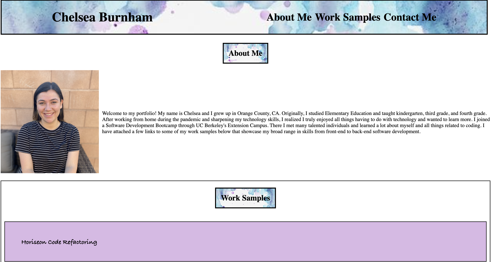
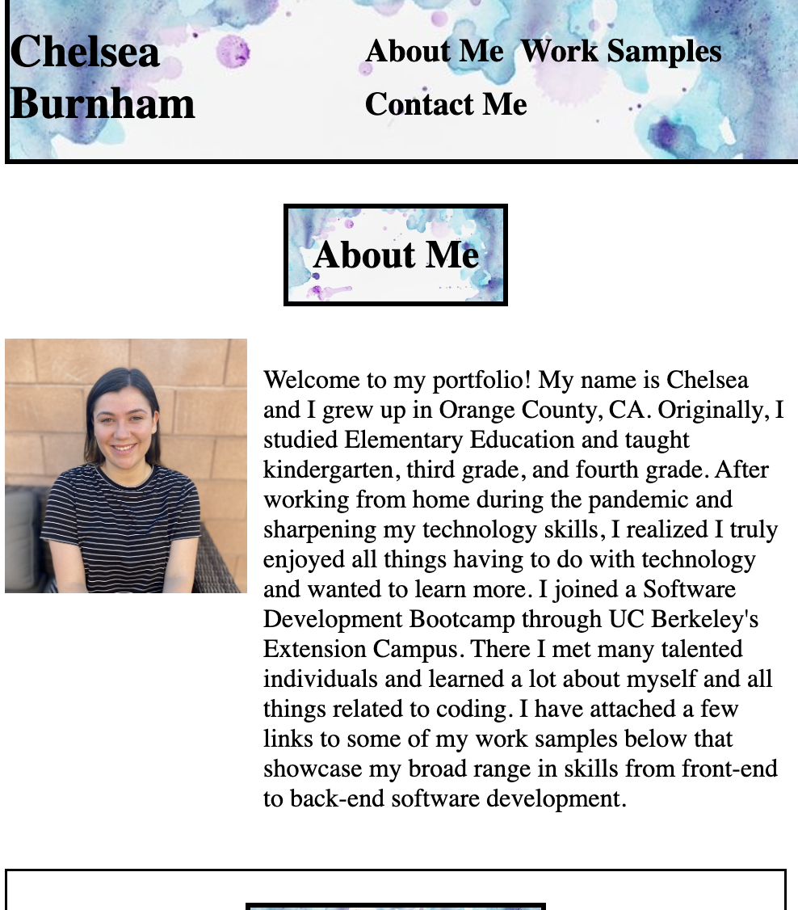

# My Portfolio

##  Description
This is my portfolio. I used HTML and CSS to create a responsive website with an About Me section, Work Samples section, and Contact Me section. The nav links included in the header will take you to the different parts of the page so it is accessible. There are links in the Work Samples section with some activies I have done including refactoring a website, collaborating with a group remotely to create a basic site, and a landing page. 

[Deployable Link](https://chelseaburnham.github.io/my-first-portfolio/)

##  Installation
To install this project, fork the repository to your Github account.  
Once on your Github account, clone the repository to your local machine. 

##  Usage
Suitable for using as a template to create a portfolio. The page has a standard banner that is fixed to the top. The links will take you do different sections of the page, and there is a section to upload work samples. It uses reponsive elements to wrap the text and shrink/grow items to make them fit the screen size. 

##  Credits
[w3schools](https://www.w3schools.com/) 
[Stack Overflow](https://stackoverflow.com/?newreg=8cd9776f072c449eac02d1ab363597c8)
[CSS Tricks](https://css-tricks.com/snippets/css/a-guide-to-flexbox/)

##  License
[MIT License](https://github.com/chelseaburnham/my-first-portfolio/blob/796b71fed27af6b8e2234d053ca667dde633926f/LICENSE)